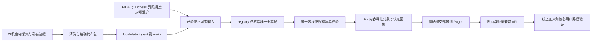

# 线上产品评审与下一阶段迭代方案

评审对象：[chessdb.aigclabs.cc](https://chessdb.aigclabs.cc/)
线上取证日期：2026-09-15；主要生产请求发生于北京时间 21:01–21:12。报告于 2026-09-16 完成核对；未将前一日快照冒充新的实时状态。
范围：技术架构、产品体验、数据维护；只读审查，未修改产品代码、采集数据或线上配置。

## 一、结论与建议

**下一阶段应围绕“找到目标 → 打开合法棋谱 → 理解覆盖范围 → 提交可追踪的纠错”完成产品闭环。继续沿用静态站点、离线事实层、R2 内容寻址和精确发布机制，优先打通它们之间的语义与体验。**

当前基础已有明显进展：查谱成为主导航；同届赛事已有父级页面和组别导航；赛事包按指纹去重并过滤非法着法；FIDE、Lichess 月度维护已自动化；registry 权威与快照/R2 认证也有可核实的实现。因此，不再把“建立赛事分组”“首次引入查谱入口”“建立月度广播维护”等已经交付的能力重复列为下一轮任务。

本次优先发现：

1. **棋谱质量门禁没有贯穿全部出口。** 呼和浩特站样本的原赛事包有 162 局，其中 12 局包含非法着法；目录过滤后为 150 局，但详情仍标记 `playableComplete=true`。居文君棋手包的 717 局中有 6 局解析错误。
2. **当前产品域名没有进入 R2 跨域许可。** 同一公开对象允许旧域名读取，却不为新域名返回 CORS 许可；棋手包主读取路径会受到浏览器限制，同源代理兜底掩盖了问题。
3. **核心指标缺少统一的用户语义。** 80,270 是按棋手累计的棋局关联数，74,550 是赛事库去重后可播放棋局数；同一棋手的 API 与搜索索引 `eventCount` 也来自不同事实范围。
4. **数据正确性已有检查，但问题解决闭环不完整。** 公共质量队列有 43 条结果冲突候选；已复核一条存在同色双方、同轮台次的明确表示冲突，尚未裁决真实结果。
5. **首次使用成本、贡献流程、分享与维护指标需要一起收敛。** 大索引、表单授权、隐私请求缺少明确送达入口，以及仍统计退役工具的贡献漏斗，都会影响实际使用和维护效率。

### 评审可信度与限制

本报告完成了生产 HTTP/JSON/PGN 核验、源码机制审查及针对线上数据的离线语义检查。**未完成真实浏览器交互和移动端视觉验收**：内置浏览器创建、状态恢复和独立 Chrome 创建连续超时，均未得到页面截图或交互状态。2026-09-16 恢复任务后再次读取浏览器状态仍超时。该工具故障不构成站点不可用的证据。

因此，文中的页面交互分析来自已核对线上正文一致的 HTML/JS/CSS；不把它表述为点击实测。没有测得 LCP、INP、CLS、移动端溢出率、真实用户转化率或国内多运营商访问表现；未执行生产表单提交、OAuth 授权、压力测试或攻击测试。浏览器与移动端补验清单见第八节。这是一份有线上证据的迭代评审，不能替代完整端到端交互验收。

## 二、生产基线与验证覆盖

### 2.1 可追溯版本

| 项目 | 本次核验结果 |
| --- | --- |
| 线上 snapshot | `20260915T063851Z-1850db6a` |
| snapshot inputCommit | `482f395360a302037bac27073e3121dc96bf7859` |
| 已部署提交 | `ce03b7f39c3afe9b0d62b28a340506896d663b0f` |
| 最新部署 | [34943857597，成功](https://github.com/keluoke/china-chess-player-pgn/actions/runs/34943857597) |
| 对应离线重建 | [34935757605，成功](https://github.com/keluoke/china-chess-player-pgn/actions/runs/34935757605) |
| 查询到的远端 main | `18f52e470c96dd995c7879cb6b52703d3e3ca91b`，后续文档提交不代表需要新的数据重建 |
| 实际部署包 | 2,384 文件，475,928 KiB；来自部署日志 |
| 官方等级分生效月 | `listDate=2026-09-01`，与重建时间分别记录 |

对 registry 正文及 manifest、公共赛事目录、赛事对象索引、目录包索引这 5 个 snapshot 输出逐一校验了 SHA-256 和字节数，均与线上 snapshot.outputs 一致。末次读取 snapshot 正文未变化。主页、app.js、events.js、contribute.js、leaderboards.js、coverage.js、styles.css、search-core.js 与本次审查的代码正文一致。

[完整机器证据](../../review-evidence/2026-09-15-production.json) 包含每次请求的时间、路径、状态、MIME、字节数、哈希、缓存头、解析结果和 GitHub 运行摘要。证据文件位于部署目录之外，避免评审 JSON 随未来站点发布被复制。

### 2.2 当前库存：必须分别解释的数字

| 指标 | 当前值 | 正确含义 |
| --- | ---: | --- |
| FIDE registry 成员 | 12,013 | 本项目注册表覆盖集合，不等于全部中国棋手 |
| registry 有中文名 | 2,439 | 注册表权威中文名，不含全部展示候选姓名 |
| 有 PGN 的 registry 成员 | 3,127 | 占 registry 26.03%，不是棋局归档完成率 |
| 搜索索引登记的国内实体 | 28,059 | 不等于 28,059 个已经跨赛事确认的独立自然人 |
| 搜索总实体口径 | 40,072 | FIDE 与国内实体合计，展示归组可能进一步合并 |
| 棋手—棋局关联数 | 80,270 | 同一局两名 registry 成员都参与时可计两次 |
| 独立棋局事实 | 76,520 | 来源事实去重后记录，仍包含不宜直接播放的记录 |
| 赛事库可播放独立棋局 | 74,550 | 事实层减去 1,343 条空/非法着法记录和 627 条隔离/测试赛事记录 |
| 父级赛事 / 有谱父级赛事 | 1,719 / 1,476 | 已收录的届/站聚合，不是全世界或中国赛事总数 |
| 底层目录记录 / 完整赛果详情 | 6,048 / 1,024 | 底层记录仍含别名、广播片段，不宜对外都叫“赛事数” |
| 日期未记录的父级赛事 | 297 | 需要来源证据，不应猜日期 |
| 标记名称待译的底层记录 | 941 | 工作队列大小，不是独立赛事系列数量 |
| Lichess 月片 | 80 | manifest 声明覆盖 2020-01 至 2026-08；本轮未重新解压全量月片 |

来源：[API manifest](https://chessdb.aigclabs.cc/api/v1/manifest.json)、[指标契约](https://chessdb.aigclabs.cc/data/public-metrics.json)、[公共目录](https://chessdb.aigclabs.cc/data/index/public-events.json)、[搜索索引](https://chessdb.aigclabs.cc/data/search-bootstrap.json)、[目录包诊断](https://chessdb.aigclabs.cc/data/index/catalog-pgn-packages.json)。

PGN 离线验证运行时为 Python 3.13.6、python-chess 1.11.2。保存了 79 次 HTTP 观测（包含重试/重定向检查）及 3 次带 Origin 的 CORS 检查；它们不是 82 个不同页面或完整全站扫描。

### 2.3 已通过的检查

- 首页及赛事、排行榜、大师赛、覆盖、贡献页面均返回 HTML；`.html` 路径正常 308 到无扩展名路由，再返回 200。该跳转本身不是故障。
- 4 名样本的姓名与三种等级分在 registry、搜索索引、API 一致：侯逸凡 8602980、居文君 8603006、许翔宇 8608288、朱子墨 260290。
- 排行榜 10 组 × 3 棋种 × 2 性别范围，共 60 维、3,717 行：检查了 registry 字段一致、分值排序、年龄范围、女子身份及同维无重复 ID，未发现错误。未对所有出生年份子桶另行穷举。
- 用线上 FIDE bootstrap 和同正文 search-core 检查 9 条查询；中文名、拼音、英文名、FIDE ID 的目标样本匹配正常；单字查询有结果，虚构查询无结果。这是搜索核心离线检查，不包含输入法、国内分片加载与 DOM 操作。
- 6 个目录 PGN 包共解析 668 条记录，均非空且无非法着法；这是包内记录总数，包含父子包重复，不能称 668 局独立抽样。
- 2 名棋手的 R2 对象与同源代理正文哈希一致；错误版本赛事请求返回 409。哈希完整性不等于对局可合法播放。
- 线上 R2 回执声明：棋手对象 7,505 个、赛事唯一对象 2,914 个，inventory 零缺失/尺寸不符，均有 384 对象轮换抽验记录。**本轮读取并核对回执和少量正文，没有独立重跑全桶认证。**

## 三、优先问题与根因

优先级定义：P0 为数据正确性/错误承诺，应先修；P1 为核心路径和高影响使用问题；P2 为效率、扩展与体验完善。没有将所有待优化项都列成阻断发布的问题。

### P0-01：合法可播放门禁与“完整”标签分离

**实证：**

| 样本 | 原赛事包 | 非法着法记录 | 目录可播放包 | 当前完整性标签 |
| --- | ---: | ---: | ---: | --- |
| 1458883，2026 呼和浩特站公开组 | 162 | 12 | 150 | `full-board-complete`、`playableComplete=true` |
| 1227491，2025 上海青浦杯大师组 | 89 | 3 | 86 | `source-published-complete` |
| 1356509，2026 李杯 B20 | 54 | 0 | 61 | `source-published-coverage-unresolved`，目录含额外合并棋谱 |

1458883 第一轮 `wais, ahmad – Lv, Ziyang` 的原包在第 24 回合黑方 `Kd5` 处出现非法 SAN；并非“12 局空着法”或轮空造成。青浦杯 3 局也有明确非法 SAN。两个样本的差額与目录合法性过滤一致。原始公开档案应保留作为证据，不能静默改写成另一份“正确棋谱”。

此外，[居文君 API](https://chessdb.aigclabs.cc/api/v1/players/fide-8603006.json) 的 717 局聚合包含 6 局非法着法、2 局 `Result=*`；前端却把聚合 gameCount 描述为“可复盘棋局”。未结束但合法的对局可以有价值，应与解析失败分别标记。

**根因：** `Scripts/build_event_library.py:30` 新增了非空合法主线判断；`Scripts/build_completeness_report.py:893` 的 `playableComplete` 仍以配对覆盖/公开归档认证推导，并没有消费该合法性结果。`docs/app.js:2434` 优先读取旧完整性布尔值；棋手包又经过另一条聚合管线。字节认证、配对匹配、棋谱合法性分别正确，并不保证其交集完整。

**方案：** 在唯一棋局事实层增加版本化质量结果，记录 `parseStatus`、合法着法长度、终局状态、结果冲突、过滤原因及原始对象哈希。所有目录、棋手包、详情和专题页共用。显式分开 `archivedRecords`、`playableGames`、`matchedPairings`、公开范围分母和实际对局分母。

**验收：** 上述样本的非法局保留证据且带原因；没有新证据修复前，不再标“可播放全台完整”；普通查谱包默认合法可播放，原档另有清晰标识；赛事包与棋手包对同一局采用一致质量状态；不能通过直接修改结果、随意截断主线或覆盖原始对象来让测试通过。

证据：[1458883 详情](https://chessdb.aigclabs.cc/data/index/event-details/tnr1458883.json)、[1227491 详情](https://chessdb.aigclabs.cc/data/index/event-details/tnr1227491.json)，原包及目录包精确路径、哈希和错误上下文见机器证据 `archiveAndPlayerPGN`、`eventPGN`。

### P1-01：新域名的 R2 CORS 配置缺失

对同一 22,567 字节对象，发送 GET/HEAD 并显式带 `Origin: https://chessdb.aigclabs.cc`，响应 200 但没有 `Access-Control-Allow-Origin`；GET 改带旧域名 `https://4chess.cc`，返回对应 ACAO 和 `Vary: Origin`。对象正文 SHA-256 正确。

`Scripts/local/r2-cors.json:5` 只列旧域名与 Pages 域名。`docs/app.js:1523` 使用跨域 fetch 读取 R2，并在失败时尝试同源代理。因此可以确认生产协议配置有缺口；依据浏览器跨域规则推断，主 fetch 将受阻、具备 fallback 的调用会再走代理。**没有浏览器网络面板证据，不断言每位用户都已遇到报错，也不把它称为全站棋谱不可用。** 跨域行为参考 [MDN CORS 文档](https://developer.mozilla.org/en-US/docs/Web/HTTP/Guides/CORS)。

方案：将当前正式站点 origin 纳入受控 CORS 配置；域名迁移清单同时覆盖网页、R2、API 文档、OAuth、canonical 与回执验证域名。保留同源 fallback，增加主读失败率指标。验收必须用真实 Origin 的 GET/HEAD 和浏览器 fetch，不能只看无 Origin 的 curl 200。复核缓存的 `Vary: Origin` 和旧域名兼容，不修改或关闭浏览器安全策略。

### P1-02：数量与覆盖状态在不同入口含义不同

首页 `docs/app.js:555` 把 80,270 直接写作“盘对局”；其机器指标虽写明“按棋手聚合”，普通用户很难知道它不是独立棋局数。API 的 `eventCount` 来自参赛事实，bootstrap 继承棋谱相关赛事计数：

| 棋手 | API eventCount | 搜索 bootstrap eventCount |
| --- | ---: | ---: |
| 侯逸凡 | 1 | 57 |
| 居文君 | 0 | 135 |
| 许翔宇 | 2 | 106 |
| 朱子墨 | 8 | 4 |

这些数不应直接断言谁算错；它们回答的是不同问题，却复用了同一字段名。聚合包的 Event 标签数量也不等于规范化后的独立赛事数量。源码：`Scripts/build_api.py:209`、`:230`，`Scripts/build_search_bootstrap.py:210`。

同时，`docs/app.js:2434` 没有直接消费 `pgnIngestStatus` 来区分“公开范围已齐”和“公开范围待核”；青浦杯与李杯的不同状态容易被压成同一个“部分直播台棋谱”。专题页已有更细状态，主入口没有一致复用。

方案：发布指标字典并由构建器输出用户文案所需字段：独立可播放局数、棋手关联数、已收录参赛记录数、含谱赛事数；保留 v1 既有字段语义，新增明确字段或在 v2 修订，不能无提示改变兼容契约。主站、专题、API 共用状态映射。

验收：同一指标从首页、棋手、赛事和 API 可追溯到同一分子/分母；“有谱”“合法可播放”“公开范围已齐”“全台完整”互不替代；对普通用户默认展示可解释的独立可播放数。

### P1-03：结果冲突被发现，但缺少逐局裁决和使用限制

[质量队列](https://chessdb.aigclabs.cc/data/audit/data-quality-review.json) 有 43 条 `pgn-result-mismatch`，涉及 15 个赛事。本轮直接复核 [1059818 详情](https://chessdb.aigclabs.cc/data/index/event-details/tnr1059818.json) 第 1 轮第 62 台：同一白方 LIAM, Valambhia、黑方 HALLMUNDARSON, Birkir，配对结果 `0 - 1`，关联 `localGame.result=1-0`。

这确认了表示冲突，未确认哪一方结果真实。其余 42 条仍是待审核候选，不能未经复核批量反转胜负。`Scripts/build_data_quality_audit.py:88` 产出队列，主棋盘尚无统一的“结果有争议”消费机制。

方案：每条 issue 用稳定棋局身份去重，记录负责人、证据、决定及重建回执；冲突局允许按明确标签查阅，暂停纳入依赖胜负的统计。优先核验同轮双方、颜色、配对自然键和原始标注，防止把误关联当成比分勘误。验收是样本有可追溯裁决，跨页面一致；保留未裁决状态，不能清空队列冒充解决。

### P1-04：首次可操作路径仍依赖较大的整包索引

| 线上资源 | 解码后正文 | 一次压缩请求传输量 | 本次该请求总耗时 |
| --- | ---: | ---: | ---: |
| FIDE 搜索 bootstrap | 3,169,720 B | 550,567 B | 2.52 s |
| 全赛事目录 | 7,171,589 B | 567,293 B | 12.61 s |
| 全排行榜 | 3,809,277 B | 319,075 B | 3.09 s |
| 居文君全部棋谱 | 2,426,425 B | 2,426,425 B | R2 样本 7.41 s |

这些是本机 curl 的单次观测，包含网络路径影响；不是 LCP、p75、纯服务器耗时或全国用户平均值。压缩已有效工作，但客户端仍需要解析大正文。

`docs/app.js:133` 先等 bootstrap，再等两个 optional manifest，才初始化搜索；其中 participation manifest 被部署脚本明确排除，实际返回首页 HTML 再被 catch 忽略。`docs/events.js:11` 获取全目录后才提供第一页；排行榜已有分片 API，网页仍加载全部维度。

方案：

- 首屏仅依赖轻量搜索描述与必要字段，补充别名/详情按需载入；optional manifest 不阻塞输入初始化，并移除明确未部署的请求。
- 父级赛事列表与详情拆开，按系列/年份载入；分片入口由版本化 manifest 描述，不在客户端遍历猜路径。
- 排行榜消费已存在的 control/cohort 分片；PGN 优先加载游戏列表与选中局，后续再做内容寻址的小批次包，避免首次看一局先拉全部历史。
- 查询计算和较大 PGN 解析可逐步移入 Worker，保留稳定缓存和取消过时请求。

建议验收预算：首屏必要压缩数据 ≤250 KB、首次列表数据 ≤200 KB；在约定中档 Android/4G 实测 p75 首次可搜索 ≤2.5 s、选中局打开 ≤2 s、输入反馈 ≤200 ms。预算是迭代目标，实施前先完成可复现基线，不以本次 curl 值作为浏览器基准。

### P1-05：贡献入口的授权范围与隐私请求路径需收敛

公开页面承诺只申请创建公开 Issue 所需权限，但 `functions/api/github/device-code.js:4` 请求 OAuth `public_repo`。该 scope 还包括公开仓库代码等读写能力，超出用户容易理解的“只发一个 Issue”；参见 [GitHub 官方 scope 说明](https://docs.github.com/en/apps/oauth-apps/building-oauth-apps/scopes-for-oauth-apps)。token 保存在 sessionStorage；本轮没有申请授权或读取任何 token。

`docs/contribute.js:82` 正确阻止隐私/身份争议进入公开 Issue，但后续只提示“通过维护者的私密联系方式发送”，所查表单及脚本没有给出明确私密收件入口。表单又提供“联系方式（可选，不公开）”，而该字段既不进入 payload 也不进入下载 JSON，仅保留在当前表单，容易让用户误以为维护者会收到。

方案：普通线索优先打开预填的 GitHub Issue，让用户在 GitHub 自行确认，或使用具备精细权限的受控提交流程；公开准确说明权限。隐私/争议提供明确的私密收件入口、送达回执及处理时限，未公开前保持本地整理。所有字段说明“谁会收到、是否保存”。验收覆盖正常、取消授权、提交失败、重复提交和私密请求，不能只验证按钮触发成功。

### P1-06：资源缺失与版本风险缺少一致的客户端契约

- 不存在的 `/data/index/this-review-file-does-not-exist.json` 返回 `200 text/html`，正文与首页相同；实际被排除的 participation manifest 也是这个结果。
- `/robots.txt` 和 `/sitemap.xml` 同样返回首页 HTML，不能作为有效 robots/sitemap 使用。
- bootstrap 响应同时出现 `max-age=300` 和 `max-age=600`；公共目录同时出现通用缓存策略与 `no-cache`。这来自 `_headers` 路径规则叠加。目录的 `no-cache` 不能被误读为允许直接陈旧命中；本轮没有发现目录正文落后。
- 赛事对象路径与错误版本 409 行为正确；普通 JSON 的 `?v=snapshotId` 仍是可变资源上的查询参数，并不天然构成不可变历史版本。
- 排行榜 payload 无 snapshotId；`docs/leaderboards.js:48` 校验 schema，没有验证正文所属 snapshot；部分覆盖面也不在同一 manifest 校验清单中。

方案：静态数据命名空间缺失时返回明确 404/MIME；公共 loader 区分网络、404、类型错误、schema 错误、版本冲突与真实空数据，并给可恢复操作。规整互斥缓存规则；对必要同批数据验证 snapshot/hash，允许不同时间更新的运维统计则单独声明契约。不能把 optional 加载失败默认为“确实没有参赛记录”。

验收：缺失 JSON 不再伪装为首页；更新期间核心数据一致或有明确刷新提示；移除缺失请求后首页不依赖异常兜底启动；CORS 与缓存检查带真实 origin、普通 URL，并验证正文。

## 四、产品体验的下一步设计

以下是基于当前线上内容与实现的设计评审；具体视觉效果、触控与键盘操作仍需真实浏览器补验。

### 4.1 明确服务对象与首要任务

| 用户 | 最常见任务 | 现有基础 | 下一版优先补齐 |
| --- | --- | --- | --- |
| 棋手/家长 | 找自己、看比赛、下载棋谱 | 中文/拼音/ID 搜索、国内档案、身份说明 | 清晰区分同名，展示最近参赛和可查看棋谱，可靠纠错入口 |
| 教练/备赛用户 | 找对手、筛近年/执色/开局 | 棋手包、赛事父页、PGN 回放、头字段文本筛选 | 结构化筛选、逐局稳定链接、保留筛选与返回位置 |
| 普通棋迷 | 快速打开一局有价值的棋 | 查谱导航、品牌故事 | 首页放可直接打开的近期赛事/示例棋局；减少首次探索成本 |
| 数据使用者 | 读取稳定、可解释的 API | 静态 v1、v2 排行预览、许可说明 | 指标字典、无谱棋手查询契约、文档与正式域名一致 |
| 维护者 | 判断缺口并安排有限资源 | 完整性、质量、补件和发布回执 | 按用户价值排序的统一待办与处理结果闭环 |

北极星指标建议为“每周成功打开并实际浏览合法棋谱的会话数”。配套观察目标棋手命中、棋谱打开成功率和纠错处理时长，避免用目录行数、原始月片规模代替产品价值。若采集产品统计，应先确定告知与数据最小化方案，不默认上传原始姓名查询。

### 4.2 统一导航、状态与上下文

1. 所有公共页共享“查棋谱 / 赛事 / 棋手 / 排行榜”主导航；数据覆盖和贡献作为稳定辅助入口。当前首页导航更完整，部分子页只保留回首页。
2. 赛事目录的系列、年份、范围、关键词、分页写入 URL；`docs/events.js` 目前只在初始化读取 `scope`，筛选后未同步历史。返回目录应恢复原筛选/滚动位置。
3. 赛事详情补“返回此赛事列表”的上下文，不能所有入口都变成“返回搜索”。父页跨组看谱，每局保留组别；分组排名继续独立。
4. 已有棋谱筛选是头字段的全文匹配。下一版提供对手、执色、年份、结果、开局等明确筛选控件，仍保留文本快捷搜索，避免要求用户知道 PGN 字段写法。
5. 逐局链接使用稳定 gameID/哈希和所属赛事/棋手上下文；列表序号可能随重建变化，不能作为长期分享身份。
6. 无谱页解释“来源未发布 / 公开但未归档 / 匹配待核 / 解析异常”，并给对应下一步。原片缺失与来源从未公开不应统一要求“再抓一次”。

### 4.3 专题与覆盖页从“维护表”变成可信说明

大师赛专题目前统计完整赛果的 301 组、62 站，状态为全台 4、公开直播齐 13、部分 10、无谱 274；这是该专题的筛选范围，不是全系列有谱库存的全量结论。45 个李杯目标和 298 个大师赛目标已进入当前广播专项 manifest，旧报告“未纳入专项匹配”的结论已过期。

推荐专题页优先显示“立即可看”的合法棋谱和组别，再展示覆盖缺口。跨页复用同一状态，不再把“无 PGN”同时用于未知、未公开和未解析成功。站名待核应作为可处理的命名缺口，保留原信息且避免误归站。

覆盖页的各指标保留分母和时间解释：`listDate` 是等级分月份、`generatedAt` 在 `stable_json.py` 中可能是内容最后变化时间、snapshot 是本次构建、verifiedAt 是验证时间。队列仍显示 8 月 24 日并不能单凭日期断言维护停止；需要展示“最近核验未变化”与其适用范围。

贡献漏斗仍统计退役 `cr-contrib` 工具下载和生成载荷 PR；线上为工具下载 4、其余计数 0。这既不能证明网站无人使用，也不能衡量现行维护效率。替换为：有效线索 → 审核接受 → 采集/离线补件 → 发布 → 线上可查看，分别记录退回/重复/来源未公开原因。不要把漏斗对象的不同分母做成错误转化率。

### 4.4 可访问性、移动端与可发现性

已存在 `lang=zh-CN`、viewport、focus-visible 和 reduced-motion 样式，应保留。静态检查中，赛事页多个 select 缺少显式 label/aria-label，日期筛选按钮只改 CSS active 状态；应补可访问名称与选中状态。

`events.html` 明确设置 `noindex,nofollow`；首页式棋手/赛事深链共用 HTML 标题与元信息，未见按实体生成的分享描述。robots/sitemap 还落到首页 fallback。若希望扩大公开赛事的自然发现，这是实质障碍；对低龄身份页不要为了 SEO 自动扩大索引范围。按页面类别制定索引政策后，为允许公开索引的赛事/专题生成静态摘要、canonical 和 sitemap，私人纠错页保持排除。

移动端采用 360/390/768 px、200% 缩放检查导航、长赛事名、组别列表、棋盘、横向表格与软键盘遮挡；键盘检查搜索、候选选择、Tab 顺序、焦点恢复和棋盘步进。**这些是待执行验收项，本次没有虚构通过结果。**

## 五、技术架构评审与演进原则

| 层 | 判断 | 下一步 |
| --- | --- | --- |
| 双工作区 | 保留；保护采集状态与开发提交边界 | 继续用受控 runtime 安装，不把 collector ahead/behind 当代码落后 |
| registry 与人工纠错 | 保留；身份和等级分唯一权威有实证 | 名称候选仅作展示/检索；纠错写规则与断言，不直接改生成 JSON |
| 独立事实层 | 保留；已消除旧派生输出反向充当事实的问题 | 承接统一棋局质量、结果争议和指标语义 |
| 统一快照构建 | 保留；required steps、SHA/版本与精确提交有效 | 扩展到跨出口语义门禁，建立输入依赖清单与增量缓存 |
| Pages + R2 | 与当前静态查询产品匹配 | 修复 origin、规范数据路由；先减重再考虑新增服务 |
| Functions | 适合轻量兼容、哈希解析与流式返回 | 避免每次冷请求解析全量 3.25 MB 赛事对象 manifest；按对象前缀分片并保持认证 |
| 前端 | 原生模块可继续用；非必须更换框架 | 先拆路由/loader/搜索/棋盘/状态映射，再做数据分片 |
| Cloudflare shadow | 维持原有边界 | 本次未核实 shadow 管理面，不建议切生产或扩付费资源 |

### 5.1 优化重建成本时保留原子性

当前 snapshot 记录 30 个步骤，合计约 504.8 秒；事实构建 158.8 秒、赛事可播放库 195.9 秒、棋手包 61.6 秒，占多数。这只是构建器计时，不包含整个 CI 队列、下载、R2 认证和部署等待。

先把合法性解析结果按 `gameSha256 + parserVersion + rulesVersion` 缓存；再按输入 manifest/hash 复用不受影响的投影。缓存命中也必须产出本次完整输出集合和回执，通过同一验证入口后原子切换。验收比较冷/热构建的语义输出，不应要求包含 snapshotId 的文件字节永远相同；PGN 对象和稳定事实应一致。

当前部署文件数远低于仓库 19,000 门禁。participation 分片仍因早期文件数说明被排除，应重新做容量评估再恢复必要能力，不能照旧假设“平台上限已迫近”。部署包仍约 465 MiB，冗余投影与回执的复制/下载成本值得优化，但不应删除审计证据。

### 5.2 模块化以缩小改动影响面

`docs/app.js` 约 2,613 行，同时处理身份展示、搜索、赛事、详情和 PGN；local 管理、面板与解析脚本也各超过千行。行数不证明代码错误，却反映测试和修改边界较大。

按用户路径与纯函数边界逐步拆分，共享 schema、状态与 loader；先固定公共契约和回归样本，再迁代码。不建议在指标和数据质量仍不统一时全仓迁框架、增加全功能后端或另建第二套事实数据库。架构文档中的旧存储树、抓取例外与维护入口说明也应同步更新。

### 5.3 发布成功后增加用户路径验收

现行精确 SHA、registry snapshot、R2 receipt 等门禁值得保留。deploy workflow 最后记录部署结果；用户路径的 CORS、合法棋谱和路由状态需要独立验证，不能只由 outbox 回执间接覆盖。

增加少量确定性生产 canary：搜索一个固定 ID、加载一个赛事组、读一个普通 URL 的内容寻址包、带正式 Origin 的跨域读取、校验缺失资源 404、检查 schema/正文哈希与声明版本。端到端浏览器结果和 HTTP 结果分栏，不以任一方替代另一方。只在有意义失败时通知维护者。

## 六、数据维护的下一步机制

1. **统一问题队列但保留类型。** 身份冲突、非法主线、结果冲突、来源公开但未归档、匹配残差、命名/站次歧义、未公开棋谱分别处理；不能用一个“待补谱”按钮全部重抓。
2. **以用户收益安排资源。** 优先修影响可播放性的既有棋谱，其次匹配已存月片与来源明确公开的缺口；用受影响用户/局数、需求次数、证据确定性与修复成本排序。
3. **月度维护变成有时效的服务承诺。** FIDE 展示官方生效月；Lichess 展示最新已完整认证月份。月份未发布、采集失败、投递失败、重建失败、线上未更新分别告警；只重试失败阶段。
4. **人工结论形成可重用规则。** 姓名更正仍进 name-corrections；转会进 federation-overrides；系列/站名修正复用词典；身份并人保留负例和撤销路径。不得把概率姓名匹配提升为 registry 权威。
5. **处置完成必须有发布回执。** 关闭问题时关联修正记录、输入哈希、构建快照、部署与线上验证；旧失败包与 successor 可追溯，不因“提交了修复”就结案。
6. **全量原片与公开投影分层留存。** 本轮 manifest 宣称月片完整不等于独立复验；保持原档/R2 不可变、来源署名和受控重放，增量索引不能丢未匹配残差。

## 七、建议迭代顺序、成本和验收

工作量为单工程师的粗估，包含针对性回归，受既有数据异常数量与验证环境影响；不是交付日期承诺。

| 阶段 | 工作包 | 优先级 | 依赖 | 估算 | 可审查的交付与退出条件 |
| --- | --- | --- | --- | --- | --- |
| A：恢复可信主路径 | R2 新域名 CORS；统一合法棋局质量；修正完整性/可播放声明；建立固定样本 canary | P0/P1 | 复用现有事实与发布门禁 | 3–5 人日 | 新域名直读和 fallback 均实测；162/150、89/86、717/6 等样本有解释且各出口一致；错误主线不再被默认宣称可完整回放 |
| B：统一事实表达 | 指标字典、事件计数字段、状态组件、43 条候选的裁决机制及高优先级样本 | P1 | A 的棋局质量字段 | 3–5 人日，历史人工裁决另计 | 主站/专题/API 分子分母明确；未裁决局带状态；不破坏 v1 字段兼容 |
| C：缩短查谱路径 | 轻量首页、赛事父目录分片、排行榜按维加载、过滤器/返回状态、明确贡献与隐私入口 | P1 | A/B；浏览器测试环境 | 5–8 人日 | 完成第八节真实旅程；达到约定数据量与响应预算；普通线索无需额外宽权限 token；私密请求可确认送达 |
| D：提高维护效率 | 质量/补件统一待办、当月认证指标、构建缓存、模块化和发布 canary | P2 | A/B 稳定契约 | 4–7 人日 | 冷热构建语义等价；问题到 online-verified 可追踪；告警分阶段且不刷屏 |
| E：增长与复用 | 合规范围内实体摘要/SEO、逐局分享、API 浏览说明、用户访谈验证 | P2 | C 的稳定路径 | 3–5 人日 | 核心公开赛事可被发现并正确分享；不扩大低龄身份公开范围；证明对查谱成功率有帮助 |

**建议先授权 A+B，验收后再决定 C 的具体界面和数据分片方案。** 优先补同一份数据在不同入口的可信表达，再扩大功能。引擎分析、账号收藏、社区评论、付费体系等本轮未发现足够需求证据，不进入首批迭代。

### 产品与维护指标

| 指标 | 定义 | 建议验收/观察方式 |
| --- | --- | --- |
| 核心查谱成功率 | 选中目标后成功打开合法棋谱的次数 / 尝试次数 | 固定 canary 100%；真实 p75/p95 与失败类型另记 |
| 可信完整率 | 标完整且通过同一合法性/配对/范围规则的对象 / 标完整对象 | 必须 100%，不通过即降级并给原因 |
| 搜索零结果率 | 有明确任务的搜索未命中 / 搜索任务 | 先建立基线，区分未收录、拼写、同名、分片失败 |
| 结果冲突处理时长 | 从发现到有证据裁决并线上验证 | 按严重程度设时限，不用简单清零衡量 |
| 数据新鲜度 | 当月 registry、上月完整广播、最近线上验证 | 官方未发布单独计量；不以重建时间冒充来源更新时间 |
| 维护吞吐与返工 | 受理→核验→发布各阶段数量、耗时、退回理由 | 同一问题稳定 ID，来源未公开不算抓取失败 |
| 成本 | 单次有效更新的构建耗时、R2 请求、对象增量、人工耗时 | 优化缓存后与相同输入冷构建对比 |

## 八、仍需执行的真实浏览器验收矩阵

这些项目因工具连接故障未执行，任何实施交付都应补齐，不能用源码测试替代。

| 用户旅程 | 具体操作 | 验收重点 |
| --- | --- | --- |
| 首页中文搜索 | 侯逸凡、许翔宇、单字“王”、不存在姓名，含中文输入法组合 | 输入可及时操作、身份正确、候选不跳动、空态有下一步 |
| 多语言与数字 | hou yifan、Hou, Yifan、8602980、260290 | 同名清楚区分，正确目标可达，六位 ID 不被提示误导 |
| 国内棋手 | 从现有国内分片取已知国内实体查询、打开深链 | 懒加载成功、身份归组说明、无谱不是加载失败 |
| 赛事查谱 | 筛 2025 大师赛上海青浦杯→父页→组别→对局→返回 | 查询状态、组别、轮台次保持；可播放数量与实际列表相同 |
| 棋手查谱 | 居文君页→选包→筛年份/对手→回放/下载 | R2 主读成功、fallback 可用、非法局清楚标记或隔离 |
| 排行榜 | 慢棋/快棋/超快棋、女子、年龄、出生年份切换 | URL 状态、分值独立、无数据解释、键盘操作 |
| 覆盖/专题 | 比较“公开范围齐/部分/待核/未公开” | 同一赛事跨入口状态一致；每个时间标签含义明确 |
| 贡献 | 普通线索、取消授权、私密删除/身份争议 | 不自动泄露私人内容、可预览、回执明确、失败可恢复 |
| 移动端与无障碍 | 360/390/768 px、200% 缩放、键盘、减少动态效果 | 无关键遮挡/溢出，控件可读可点，焦点与选中状态正确 |
| 更新与故障 | 冷缓存/旧缓存、网络中断、缺失 JSON、错误 PGN 版本 | 明确区分错误与空数据，刷新恢复且无混合快照 |

## 九、交付与使用说明

- 报告与证据属于下一步迭代依据；本次没有执行任何产品整改、源站回抓、线上配置修改或部署。
- 阶段进度持续记录在根目录 `CODEX_PROGRESS.md`；已按阶段进行本地 Git 提交，不推送文档以免意外触发部署。
- 已运行搜索核心及姓名展示现有测试，并对公开数据做独立排名/PGN 检查；未宣称全仓回归、完整安全审计或完整移动端体验测试通过。
- 历史审查仅用于寻找回归样本；上述主要现状均在本轮重新核验。旧日期、数量和未完成项不能覆盖当前线上证据。
